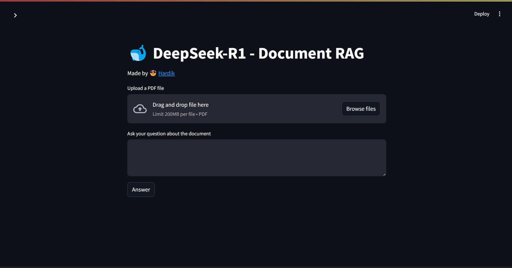

# DeepSeek-R1 Document Q&A System

Welcome to the DeepSeek-R1 Document Q&A System! This project leverages Retrieval-Augmented Generation (RAG) techniques to enable efficient question-answering from PDF documents using the DeepSeek-R1 model.

## Project Overview

The DeepSeek-R1 Document Q&A System is designed to process PDF documents and provide accurate answers to user queries based on the content of these documents. By combining document retrieval with the generative capabilities of the DeepSeek-R1 model, this system offers precise and contextually relevant responses.



## Features

- **PDF Document Processing**: Upload and process PDF files to extract and index content.
- **Interactive Q&A Interface**: Pose questions related to the uploaded documents and receive detailed answers.
- **Streamlit Integration**: User-friendly web interface built with Streamlit for seamless interaction.
- **Custom API Key Configuration**: Easily input your own API key through the Streamlit sidebar for personalized usage.

## How to Use

1. **Clone the Repository**:
   ```bash
   git clone https://github.com/hardikjp7/DeepSeek-R1-RAG-for-Document-QA
   cd DeepSeek-R1-RAG-for-Document-QA
   ```

2. **Install Dependencies**:
   Ensure you have Python installed. Then, install the required packages:
   ```bash
   pip install -r requirements.txt
   ```

3. **Set Up API Key**:
   - Launch the application:
     ```bash
     streamlit run main.py
     ```
   - In the Streamlit sidebar, enter your DeepSeek-R1 API key in the provided input field.

4. **Upload a PDF Document**:
   - Use the file uploader in the main interface to upload your PDF file.
   - The system will process and index the document for querying.

5. **Ask Questions**:
   - Enter your question related to the uploaded document in the text area.
   - Click the "Answer" button to receive a response generated by the DeepSeek-R1 model.

## Code Structure

- `main.py`: Contains the Streamlit application code, handling user interactions and displaying the interface.
- `rag_utility.py`: Includes functions for processing documents, managing the vector store, and interfacing with the DeepSeek-R1 model.

## Contributing

We welcome contributions to enhance this project. Feel free to fork the repository, make improvements, and submit pull requests. Please ensure adherence to the project's coding standards and include appropriate tests for new features.

---

Thank you for exploring the DeepSeek-R1 Document Q&A System! If you have any questions or need assistance, please open an issue in this repository. 
